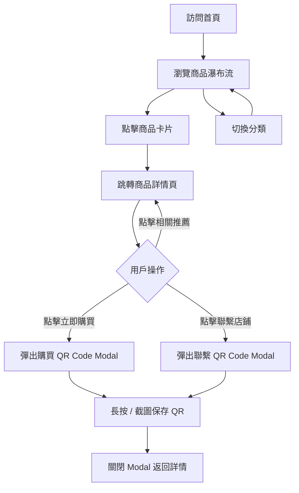

# 產品需求文檔（PRD）：匠物 — 日系生活好物

## 1. 產品概述

「匠物」是一個純靜態的日系生活好物移動端展示網站，主打「侘寂・手作・日常儀式感」美學。目標用戶為喜愛日系生活風格、追求品質感商品的年輕用戶，網站以展示為主，點擊「立即購買 / 聯繫店鋪」時彈出 QR Code 引導用戶至 LINE / WeChat 完成下單或諮詢，無在線支付功能。

## 2. 核心功能

### 2.1 用戶角色
本產品無登錄註冊體系，所有訪客均可瀏覽商品與觸發 QR Code 彈窗。

| 角色 | 進入方式 | 核心權限 |
|------|----------|----------|
| 訪客 | 直接訪問 | 瀏覽商品列表 / 查看詳情 / 觸發購買或聯繫 QR Code |

### 2.2 功能模組

1. **首頁（Home）**：品牌 Hero 區、商品分類標籤、瀑布流商品網格、頁腳品牌資訊
2. **商品列表區（Collection）**：分類切換（全部 / 茶器・餐具 / 文房・手作 / 居家・擺件 / 食・甜點）
3. **商品詳情頁（Product Detail）**：商品大圖輪播、規格、材質說明、價格、CTA 按鈕
4. **QR Code 彈窗（QR Modal）**：購買 / 聯繫兩種二維碼場景，自動生成並可保存
5. **底部導航（Bottom Nav）**：首頁 / 收藏（佔位） / 客服 QR / 我的（佔位）

### 2.3 頁面與模組明細

| 頁面 | 模組 | 功能描述 |
|------|------|----------|
| 首頁 | Hero 區 | 全屏背景圖 + 日文標語 + CTA 引導 |
| 首頁 | 分類條 | 5 個分類 chip，可切換商品列表 |
| 首頁 | 商品網格 | 2 列瀑布流卡片，含圖、名、日文副標、價格 |
| 首頁 | 頁腳 | 品牌故事 + 社交連結 |
| 詳情頁 | 圖片畫廊 | 點擊切換主圖（最多 3 張） |
| 詳情頁 | 商品信息 | 名稱、日文名、價格、材質、尺寸、產地 |
| 詳情頁 | 詳情描述 | 工藝故事 + 規格列表 |
| 詳情頁 | CTA 區 | 「立即購買」「聯繫店鋪」兩顆按鈕 |
| 詳情頁 | 相關推薦 | 底部推薦 3 件同類商品 |
| 彈窗 | QR Code | 顯示 LINE / WeChat / Email 等二維碼 + 提示文案 + 關閉 |

## 3. 核心流程

## 4. 用戶界面設計

### 4.1 設計風格

- **整體調性**：侘寂美學 × 現代極簡，留白充足、節制內斂，給人「安靜的好物」感
- **主色**：
  - `#1a1a1a`（墨色・主文字）
  - `#faf7f2`（和紙白・背景）
  - `#b94a48`（朱紅・強調 / 按鈕 / 點綴）
  - `#7a8a7a`（抹茶綠・次要強調）
  - `#d6cfc4`（砂金・分隔線 / 邊框）
- **字體**：
  - 中文：「Noto Serif SC」襯線標題 + 「Noto Sans SC」正文
  - 日文：「Noto Serif JP」副標 / 標語 + 「Klee One」手寫體點綴
- **按鈕**：圓角 4px 矩形，主按鈕實心朱紅、次按鈕描邊墨色
- **佈局**：移動端豎向單列 / 兩列卡片，內容寬度最大 480px 居中
- **圖標**：使用 Bootstrap Icons + 少量自繪 SVG

### 4.2 頁面設計概覽

| 頁面 | 模組 | UI 元素 |
|------|------|----------|
| 首頁 | Hero | 4:5 豎圖 + 日文豎排標語（縦書き）+ 滾動提示 |
| 首頁 | 分類條 | 橫向滾動 chip，當前態底部朱紅下劃線 |
| 首頁 | 商品網格 | 2 列卡片，圓角 8px，圖佔比 4:5，名稱 / 日文 / ¥ 價格 |
| 詳情頁 | 畫廊 | 主圖 + 縮略圖條，圓角 8px，淡陰影 |
| 詳情頁 | 信息 | 標題 + 日文羅馬音副標 + ¥ 價格大字 + 規格表格 |
| 詳情頁 | CTA | 底部固定 sticky bar，兩顆按鈕並排 |
| 彈窗 | QR | 居中卡片，白底圓角 16px，QR 圖 + 說明文字 + 關閉 X |

### 4.3 響應式

- **移動端優先**（Mobile First）：設計基準 375px，適配至 480px
- 桌面端居中顯示，最大寬度 480px，兩側留白，模擬手機視窗
- 觸摸優化：所有可點擊區域 ≥ 44×44px

### 4.4 動效

- 首頁 Hero 進入：標語字符逐個 fade-up，間隔 80ms
- 商品卡片：hover / active 時 scale(1.02) + 陰影加深
- 詳情頁：滾動時信息區域 stagger fade-in
- 彈窗：scale(0.92) → 1 + 蒙層 fade-in，250ms ease-out
- 切換分類：商品卡片淡出再淡入

## 5. 商品數據

預置 10 款日系商品，分屬 4 個分類：

| ID | 名稱 | 日文 | 分類 | 價格（¥） |
|----|------|------|------|-----------|
| p01 | 宇治抹茶套裝 | 宇治抹茶セット | 茶器・餐具 | 168 |
| p02 | 櫻花和菓子禮盒 | 桜の和菓子詰合せ | 食・甜點 | 128 |
| p03 | 招財貓擺件 | 招き猫 | 居家・擺件 | 98 |
| p04 | 漆金筷組 | 漆塗り金箸 | 茶器・餐具 | 88 |
| p05 | 富士山玻璃杯 | 富士グラス | 茶器・餐具 | 78 |
| p06 | 風鈴 | 風鈴 | 居家・擺件 | 68 |
| p07 | 和紋手帕 | 和柄ハンカチ | 文房・手作 | 38 |
| p08 | 旅人手帳 | 旅の手帳 | 文房・手作 | 158 |
| p09 | 折紙禮盒 | 折り紙セット | 文房・手作 | 58 |
| p10 | 抹茶毛巾布 | 抹茶タオル | 居家・擺件 | 48 |
