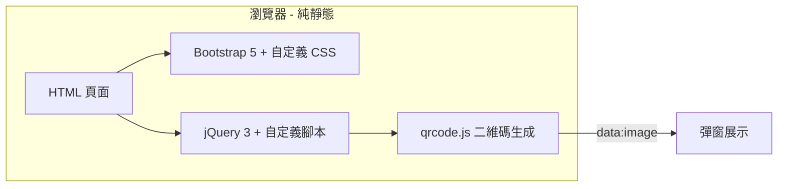

# 技術架構文檔：匠物 — 日系生活好物

## 1. 架構設計



採用純前端 SPA-like 多頁架構：使用 jQuery 控制頁面跳轉與數據渲染，無後端，無構建工具。

## 2. 技術棧

- **HTML5**：語義化標籤
- **CSS3**：自定義樣式 + CSS 變量
- **Bootstrap 5.3.x**（CDN）：柵格、工具類、Modal 組件
- **Bootstrap Icons**（CDN）：UI 圖標
- **jQuery 3.7.x**（CDN）：DOM 操作、事件、AJAX
- **qrcode.js 1.0.0**（CDN）：客戶端生成 QR Code
- **字體（CDN / Google Fonts）**：Noto Serif SC / Noto Sans SC / Noto Serif JP / Klee One
- **後端**：無
- **數據庫**：無，使用 JS 對象作為 mock 數據

## 3. 路由定義

| 路由 | 文件 | 說明 |
|------|------|------|
| `/` 或 `/index.html` | index.html | 首頁：Hero + 分類 + 商品網格 |
| `/product.html?id=p01` | product.html | 商品詳情頁，根據 `id` 查詢 mock 數據 |
| `/about.html` | about.html | 品牌故事頁（可選） |
| 錨點 `#qr-modal` | — | 觸發 QR Code 彈窗 |

頁面間跳轉使用原生 `?id=xxx` 查詢參數，jQuery 讀取 `location.search` 渲染對應商品。

## 4. 目錄結構

```
jp-shop/
├── index.html                  # 首頁
├── product.html                # 詳情頁模板
├── assets/
│   ├── css/
│   │   └── style.css           # 自定義主題
│   ├── js/
│   │   ├── data.js             # 商品 mock 數據
│   │   ├── home.js             # 首頁邏輯
│   │   ├── product.js          # 詳情頁邏輯
│   │   └── qr-modal.js         # QR 彈窗通用邏輯
│   └── images/
│       └── (生成式商品圖)
└── .trae/
    └── documents/
        ├── PRD.md
        └── TECH.md
```

## 5. 數據模型

### 5.1 商品對象結構

```js
{
  id: 'p01',                       // 唯一標識
  name: '宇治抹茶套裝',            // 中文名
  nameJa: '宇治抹茶セット',         // 日文名
  category: 'tea',                 // 分類 key
  categoryName: '茶器・餐具',       // 分類顯示名
  price: 168,                      // 價格（元）
  cover: 'assets/images/p01-cover.jpg',
  images: [                        // 詳情圖
    'assets/images/p01-1.jpg',
    'assets/images/p01-2.jpg',
    'assets/images/p01-3.jpg'
  ],
  material: '陶器 / 竹',            // 材質
  size: '茶碗 8cm / 茶筅 10cm',     // 尺寸
  origin: '日本・宇治',             // 產地
  description: '…',                // 詳情描述（HTML）
  tags: ['手作', '限定']            // 標籤
}
```

### 5.2 分類枚舉

| key | 顯示名 |
|-----|--------|
| all | 全部 |
| tea | 茶器・餐具 |
| craft | 文房・手作 |
| home | 居家・擺件 |
| food | 食・甜點 |

## 6. 關鍵交互實現

### 6.1 QR Code 彈窗

- 點擊「立即購買」→ `openQR('buy', product)` → 動態填充 Modal，調用 `new QRCode(el, { text: 'https://line.me/...' })`
- 點擊「聯繫店鋪」→ `openQR('contact', product)` → 顯示 WeChat / 郵箱 QR
- 使用 Bootstrap 5 原生 `bootstrap.Modal` 組件
- 文案支持中 / 日 / 英切換（默認中文）

### 6.2 商品詳情渲染

- `product.html?p01` 加載時 `product.js` 讀取 `id` → 從 `data.js` 查找 → 動態填充 DOM
- 缺貨或 id 不存在 → 顯示空狀態並提供返回首頁鏈接

### 6.3 分類切換

- 點擊 chip → 更新 `active` 樣式 → 重新過濾商品數組 → 重新渲染網格
- 動畫：fade-out 150ms → 替換 DOM → fade-in 200ms

## 7. 性能與可訪問性

- 所有外部資源使用 CDN，支持緩存
- 圖片使用生成式 API，size 控制在合理範圍
- ARIA：按鈕 `aria-label`，Modal 焦點管理
- 觸摸目標 ≥ 44×44px
- 動效使用 `prefers-reduced-motion` 降級

## 8. 瀏覽器兼容

- iOS Safari 14+
- Android Chrome 90+
- 不支持 IE

## 9. 本地預覽

使用 Python 或 Node 啟動靜態服務器：

```bash
# 任選其一
python3 -m http.server 8080
npx serve .
```

訪問 `http://localhost:8080/`。
